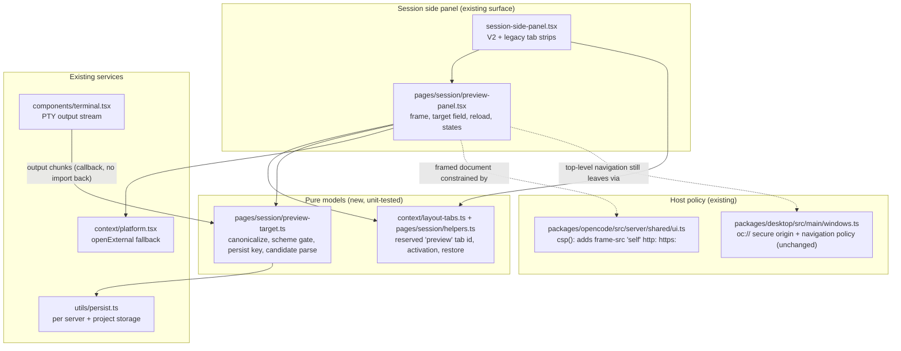
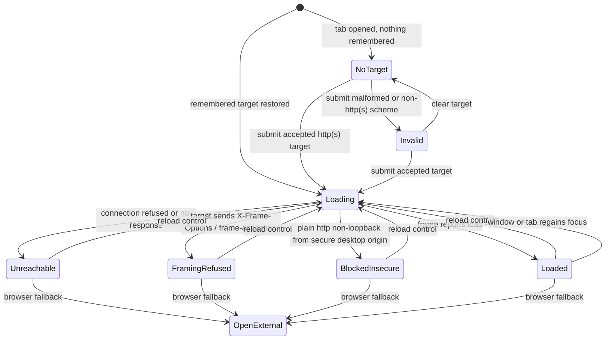
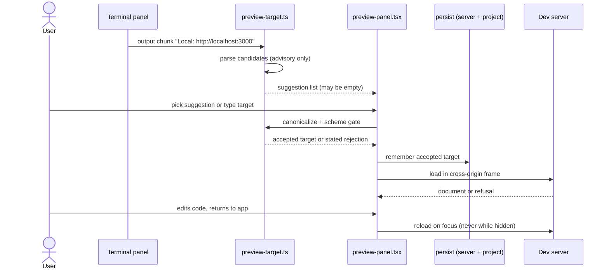

# Design

## Current state

none

## Domain language

| Canonical term | Meaning | Avoid |
|---|---|---|
| `none` | This change introduces no project-specific term. | `none` |

## Decisions

- **Decision ID:** DEC-001
  - **Status:** accepted
  - **Decision:** Preview lives as a reserved session side-panel tab beside Files Changed rather than a bottom panel next to the terminal or a new top-level tab type.
  - **Why:** The side-panel tab model in packages/app/src/pages/session/helpers.ts and session-side-panel.tsx already provides reserved tab ids, per-session state, split sizing and keyboard behavior, so the preview inherits them without new tab persistence or migration.
  - **Rejected:** none
  - **Consequences:** No consequence beyond the bounded change
  - **Supersedes:** none
  - **Superseded by:** none
- **Decision ID:** DEC-002
  - **Status:** accepted
  - **Decision:** The target is user-entered and remembered per project; targets seen in terminal output are only suggestions and never navigate on their own.
  - **Why:** Terminal output is the only live source the app already receives; the persisted terminal buffer in packages/app/src/context/terminal.tsx is written on cleanup, so detection cannot be treated as authoritative or complete.
  - **Rejected:** none
  - **Consequences:** No consequence beyond the bounded change
  - **Supersedes:** none
  - **Superseded by:** none
- **Decision ID:** DEC-003
  - **Status:** accepted
  - **Decision:** Extend the served UI policy with a frame-src allowance for http and https targets instead of relaxing default-src or dropping the policy.
  - **Why:** packages/opencode/src/server/shared/ui.ts sets default-src 'self' with no frame-src or child-src, so framing a dev server is blocked in serve and web mode while the desktop renderer, which injects no policy, would work; a scheme-bounded frame-src is the smallest change that makes both hosts behave the same.
  - **Rejected:** none
  - **Consequences:** No consequence beyond the bounded change
  - **Supersedes:** none
  - **Superseded by:** none
- **Decision ID:** DEC-004
  - **Status:** accepted
  - **Decision:** Plain http targets on non-loopback hosts stay in scope but surface an explicit blocked-insecure-content state with a browser fallback on the desktop renderer.
  - **Why:** The desktop renderer loads from the oc:// scheme registered secure:true in packages/desktop/src/main/windows.ts, so Chromium blocks non-loopback http frames as mixed content; the limit cannot be removed from the app and must be visible instead of a blank pane.
  - **Rejected:** none
  - **Consequences:** No consequence beyond the bounded change
  - **Supersedes:** none
  - **Superseded by:** none
- **Decision ID:** DEC-005
  - **Status:** accepted
  - **Decision:** The preview accepts any http or https host, not only loopback, and rejects all other schemes.
  - **Why:** The user asked for staging and remote targets as well as local dev servers; scheme rejection keeps file, data and javascript targets out of the frame.
  - **Rejected:** none
  - **Consequences:** No consequence beyond the bounded change
  - **Supersedes:** none
  - **Superseded by:** none
- **Decision ID:** DEC-006
  - **Status:** accepted
  - **Decision:** Reload happens on an explicit control and when the app or Preview tab regains focus, never on a hidden timer or project file watcher.
  - **Why:** Dev servers with HMR already refresh themselves; focus reload covers the restart case without competing with HMR or spending resources while hidden.
  - **Rejected:** none
  - **Consequences:** No consequence beyond the bounded change
  - **Supersedes:** none
  - **Superseded by:** none

## Compatibility and migration

none

## Risks

| Risk | Mitigation | Evidence owner |
|---|---|---|
| none | none | none |

## Diagrams

### Module map

Allowed dependency direction; no module imports one above it.

### Target and load state machine

Every reachable state and the only transitions that produce it; none blanks the panel.

### Suggest, load, reload sequence

How a suggestion becomes a loaded preview without ever navigating on its own.

## Code architecture

### Layering and dependency direction

| Layer | Files | Responsibility | May import |
|---|---|---|---|
| Tab state model | `packages/app/src/context/layout-tabs.ts`, `packages/app/src/pages/session/helpers.ts` | Reserve the `preview` tab id next to `review`, `context` and `open-file`; activation, close and per-session restore | nothing app-specific (pure) |
| Target model | `packages/app/src/pages/session/preview-target.ts` | Canonicalize input, gate schemes to http/https, build the per-server-and-project persistence key, parse advisory candidates from terminal text | `utils/persist` only |
| Panel component | `packages/app/src/pages/session/preview-panel.tsx` | Render frame, target field, suggestions, reload control, browser fallback and the seven text states; own focus-reload effect | tab state model, target model, existing V2 components, `context/platform` |
| Panel host | `packages/app/src/pages/session/session-side-panel.tsx` | Mount the tab in the V2 and legacy tab strips using the existing tab, keyboard and close behavior | panel component |
| Host policy | `packages/opencode/src/server/shared/ui.ts` | Allow framing from the served UI through one added `frame-src` directive | unchanged server modules |

One-way rules: `preview-target.ts` imports no UI; the terminal reports output through a callback prop, never importing `preview-*`; `session-side-panel.tsx` gains no state beyond existing tab plumbing.

### State ownership

- **Active tab:** existing session tab state, keyed per server and session; Preview is one more reserved id, not a new store.
- **Target:** target model, persisted per server and canonical project directory, so no project inherits another's URL.
- **Load state:** component-local, never persisted, so a restart re-probes instead of replaying a stale failure.
- **Suggestions:** transient, live only as long as the terminal output behind them.

### Isolation boundary

- The frame is always a foreign origin, so it cannot read app storage or tokens; `allow-same-origin` serves the target's own origin (dev-server storage and HMR socket) and grants nothing against the app origin.
- Top-frame navigation and popups are not delegated; desktop keeps routing them to the OS. No credential, auth token, server URL secret or session id enters the frame URL, headers or referrer.
- `csp()` gains `frame-src 'self' http: https:` and nothing else; embedded and upstream-proxied HTML inherit it from the same builder.

### Test seams

| Claim | Seam | Command |
|---|---|---|
| `preview-tab-surface` | Pure tab state functions and panel render under happy-dom | `cd packages/app && bun typecheck && bun run test:unit` |
| `preview-target-selection` | Pure canonicalize/scheme/persist/parse functions | `cd packages/app && bun run test:unit` |
| `preview-frame-isolation` | Frame attribute assertions in the panel test plus CSP header assertions beside the existing ones | `cd packages/opencode && bun test test/server/httpapi-ui.test.ts` |
| `preview-reload-and-states` | State-to-text mapping and focus-reload effect under happy-dom; browser regression against framable and refusing targets | `cd packages/app && bun run test:unit`, `bun run typecheck:e2e` |
